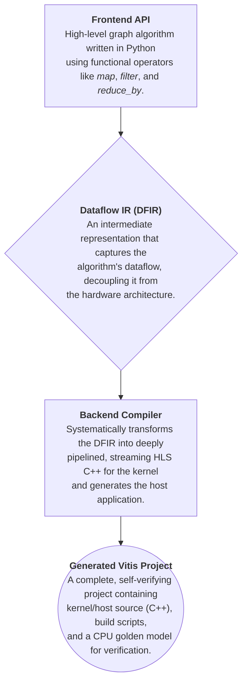

# GraphyFlow: A Flexible High-Level Synthesis Framework for Efficient Graph Computing on FPGAs

## 1\. Overview

GraphyFlow is a Python-based framework designed to simplify the development of graph algorithms for hardware acceleration on FPGAs. It provides a high-level, functional API for developers to express complex graph computations. The framework then automatically translates this high-level description into a Dataflow-Graph Intermediate Representation (DFG-IR), which is subsequently compiled into a complete, runnable Vitis HLS project, including HLS C++ for the kernel and C++ for the host application.

The primary goal of GraphyFlow is to abstract away the complexities of HLS and FPGA project management, allowing domain experts to focus on the algorithm's logic while still leveraging the performance of hardware acceleration.

## 2\. Core Concepts & Architecture

GraphyFlow employs a multi-stage compilation architecture to transform a high-level Python definition into a low-level hardware implementation.



## 3\. Prerequisites

To use GraphyFlow and build the generated projects, you will need the following software installed and configured on your system:

  * **Python 3.x**: For running the GraphyFlow framework itself.
  * **Xilinx Vitis**: The core toolchain for HLS and building the FPGA binaries. The project files seem to be configured for **Vitis 2022.2**, so using this version is recommended for compatibility.
  * **Xilinx Runtime (XRT)**: Required for communication between the host and the FPGA. This is typically installed with Vitis.
  * **Environment Variables**: Before building the project, ensure that the Vitis and XRT environment setup scripts have been sourced. Execute the following commands, adjusting the paths to match your installation:
  ```shell
    # Source Vitis environment
    source /path/to/Xilinx/Vitis/2022.2/settings64.sh

    # Source XRT environment
    source /opt/xilinx/xrt/setup.sh
  ```

## 4\. Directory Structure

The GraphyFlow repository is organized as follows:

```
CCFSys2025_GraphyFlow/
├── README.md                # This README file
├── graphyflow/              # Core framework source code
│   ├── backend_manager.py     # The main backend compiler for C++/HLS generation
│   ├── dataflow_ir.py         # Defines the Intermediate Representation (IR)
│   ├── global_graph.py        # The user-facing Python API for algorithm definition
│   ├── project_generator.py   # Assembles the final Vitis project
│   └── project_template/      # Static template files for a Vitis project
└── tests/                   # Example scripts demonstrating how to use GraphyFlow
    └── bellman_ford.py        # The primary example for generating a project
```

## 5\. How to Run the Example

The following steps guide you through generating, building, and running the provided Bellman-Ford project.

### 5\.1 Input Data Format (`graph.txt`)

The generated host application expects an input graph file named graph.txt to be present in the execution directory (generated_project/). This file should be a simple text file representing the graph as an edge list.

Each line should represent a directed edge with the format source_node destination_node [weight].

Node IDs are 0-indexed integers.

If the weight is omitted, it defaults to 1.

The project template also includes a Python script gen_random_graph.py to generate sample graph files.

An example graph.txt could look like this:

```
1 5
5 1
6 2
1 3
2 6
4 0
3 1
7 6
5 6
3 5
0 2
2 0
5 3
6 5
6 7
0 4
```

### 5\.2 Step 1: Generate the Vitis Project
The framework uses the pre-defined algorithm in tests/bellman_ford.py to generate a complete Vitis project. To start the process, execute the following command from the root of the CCFSys2025_GraphyFlow directory:

```shell
PYTHONPATH=$(pwd) python3 tests/bellman_ford.py
```

This command temporarily adds the project root to your Python path and runs the generation script. After it completes, a new directory named generated_project/ will be created, containing the full Vitis project.

### 5\.3 Step 2: Build the FPGA Kernel and Host Executable
Navigate into the generated project directory and use the provided Makefile to build the project. Before running make, ensure you have sourced the Vitis and XRT environment scripts as described in the "Prerequisites" section.

```python
# Navigate to the generated project
cd generated_project/

# Build and run for software emulation
make check TARGET=sw_emu
```

- The `make check` command builds the project and runs the simulation afterwards.
- `TARGET` can be one of the following:
    - `sw_emu`: Software emulation (fastest build).
    - `hw_emu`: Hardware emulation (more accurate, slower build).
    - `hw`: Full hardware synthesis (for running on the actual FPGA).

### 5\.4 Step 3: Run the Project
If you built the project using `make all` instead of `make check`, you can run the emulation manually with the `run.sh` script:

```shell
./run.sh sw_emu
```

The script will execute the host program, which loads the FPGA binary (`.xclbin`), runs the computation on the `graph.txt` file, verifies the result against a CPU implementation, and prints a success or failure message.

## 6\. Detailed Documentation

For a deeper understanding of the framework's architecture and components, please refer to the detailed documentation:

- docs/frontend.md: Describes the user-facing Python API for defining graph algorithms.
- docs/ir.md: Explains the structure of the Dataflow-Graph Intermediate Representation (DFG-IR).
- docs/backend_kernel.md: Details the process of translating the IR into HLS C++ for the FPGA kernel.
- docs/backend_host.md: Covers the generation of the host application, build system, and other supporting files.
